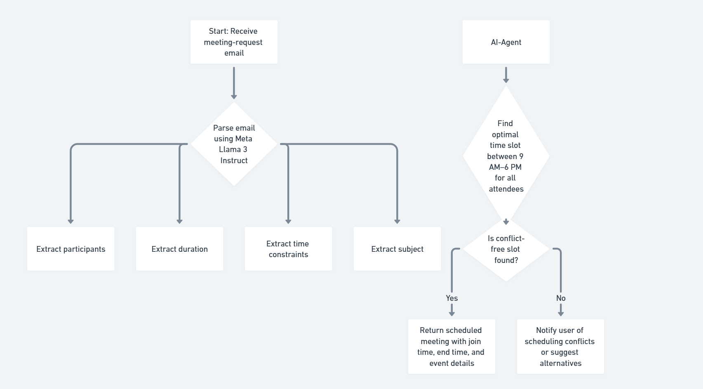
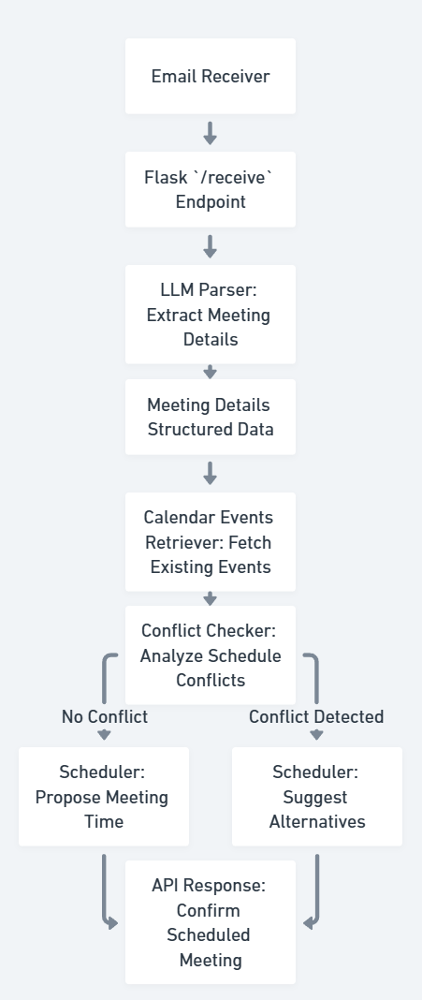

# Meeting Scheduler AI Agent  
**MeetS AI**  


[](https://docs.langchain.com/docs/components/agents)


---

## 📋 Table of Contents
1. [Project Overview](#project-overview)  
2. [High Level Overview](#high-level-overview)
3. [Project Structure](#)
4. [Features](#features)  
5. [Tech Stack & Tools](#tech-stack--tools)  
6. [Architecture Diagram](#architecture-diagram)  
7. [Demo](#demo)  
8. [Installation & Setup](#installation--setup)  
9. [Configuration](#configuration)  
10. [Usage](#usage)  
11. [API Endpoints](#api-endpoint)
12. [Contributors]()

---

## 🚀 Project Overview
An AI-powered meeting scheduler built as a Flask microservice that:
- Parses incoming meeting-request emails using a large language model (Meta Llama 3 Instruct).
- Extracts participants, duration, time constraints, and subject.
- Retrieves calendar events from Google Calendar.
- Finds an optimal time slot for all attendees between 9 AM–6 PM.
- Returns a scheduled meeting with join time, end time, and conflict-free event details.

---
## High Level Overview
<p align="center">
  
</p>

---

## Project Strucutre
```bash
AMD_Hack_GPu_Poor/
│
├── assets/           
├── Main.ipynb     
├── Readme.md          
└── Requirements.txt   
```

## ✨ Features
- **Email Parsing**: Extracts participants, meeting length, subject, and timing from free-form text.  
- **Time Inference**: Handles relative dates (`next Monday`, `next week`), default slots.  
- **Conflict Detection**: Checks Google Calendar events for collisions.  
- **Auto-Scheduling**: Iterates through business-hour slots and books the earliest conflict-free time.  
- **REST API**: Single `/receive` POST endpoint for integration with mail gateways, bots, or UIs.

---

## 🛠 Tech Stack & Tools
| Layer            | Technology                              | Description                                               |
|------------------|-----------------------------------------|-----------------------------------------------------------|
| Language         | Python 3.9+                             | Core glue and business logic                              |
| Web Framework    | Flask 2.x                               | API server and routing                                    |
| Concurrency      | `threading.Thread`                      | Non-blocking server startup                               |
| LLM Inference    | Meta-Llama-3.1-8B-Instruct (vLLM)      | Parses meeting emails via OpenAI-compatible client        |
| Authentication   | OAuth 2.0 (Google Credentials file)     | Service account tokens for Google Calendar API            |
| Calendar API     | Google Calendar API v3                  | Fetches existing events for conflict checking             |
| Date Handling    | `python-dateutil`, `datetime`, `tzinfo` | Timezone-aware parsing & date arithmetic                  |
| Dev Tools        | `pip`, `venv`                           | Virtual environment and package management                |

---

## 🏗 Architecture Diagram
<!-- Replace with actual diagram -->
<p align="center">
  
</p>

---
## Demo

<p align="center"> <a href="assets/3_am-.mp4"></a> </p>

---
## ⚙️ Installation & Setup

### Step 1: Clone the Repository
Clone the project repository from GitHub:
```bash
git clone https://github.com/your-org/meeting-scheduler-agent.git
cd meeting-scheduler-agent
```

#### Step 2: Create and Activate Virtual Environment
Create a virtual environment and activate it:

```bash
python3 -m venv venv
source venv/bin/activate  # For Linux/macOS

# For Windows
venv\Scripts\activate
```
### Step3:Install Dependencies:
```bash
pip install -r requirements.txt
```

### Step 4: Deploy the LLM using vLLM:
```bash
HIP_VISIBLE_DEVICES=0 vllm serve /home/user/Models/deepseek-ai/deepseek-llm-7b-chat \
    --gpu-memory-utilization 0.9 \
    --swap-space 16 \
    --disable-log-requests \
    --dtype float16 \
    --max-model-len 2048 \
    --tensor-parallel-size 1 \
    --host 0.0.0.0 \
    --port 3000 \
    --num-scheduler-steps 10 \
    --max-num-seqs 128 \
    --max-num-batched-tokens 2048 \
    --distributed-executor-backend "mp"
#Choose your preferred model
```
---
## Configuration
🔹 Google OAuth Token
Place the user OAuth token in:
```bash
Keys/{username}.token
```

🔹 Environment Variables
```bash
export MODEL_PATH="/path/to/meta-llama-3-instruct"
export OPENAI_API_BASE="http://localhost:4000/v1"
```
---
## 💻 Usage

### ✅ Start the Flask Server
Run the Flask app to start the Meeting Scheduler API:
```bash
python your_flask_app.py
```

---
## API Endpoint
POST /receive: Endpoint to send meeting details and schedule a meeting.

Example Request
Send a POST request to:


```bash
http://localhost:5000/receive
```

## 👥 Contributors

- [Param Thakkar](https://github.com/ParamThakkar123)
- [Abhi Mehta](https://github.com/MehtaAbhii)
